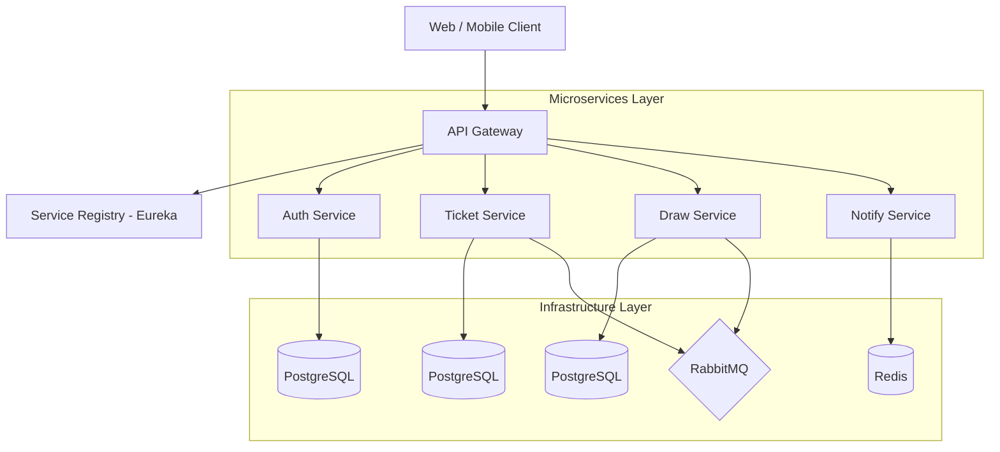
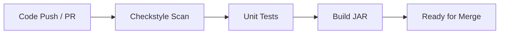

# SmartLotto


**SmartLotto** là một hệ thống quản lý và tham gia xổ số trực tuyến thông minh, được thiết kế để mang lại trải nghiệm tiện lợi, minh bạch và an toàn cho người dùng trên đa nền tảng (Web, Mobile).

---

## 📌 1. Tổng quan dự án

Dự án này nhằm mục tiêu hiện đại hóa các quy trình mua và quản lý vé số truyền thống, tích hợp các công cụ phân tích thông minh và giao diện người dùng thân thiện.

### Các đặc điểm chính:
- **Đa nền tảng:** Hỗ trợ trên Web (ReactJS) và Mobile (Flutter).
- **Kiến trúc Microservices:** Hệ thống backend mạnh mẽ, linh hoạt và dễ mở rộng.
- **Tiện lợi:** Tích hợp thanh toán và quản lý vé tự động.
- **Thông báo:** Cập nhật kết quả nhanh chóng qua ứng dụng di động.

---

## 🏗️ 2. Kiến trúc hệ thống (System Architecture)

Hệ thống được phát triển theo mô hình Microservices kiến trúc hướng dịch vụ:



---

## 🚀 3. Backend Microservices Setup

Phân hệ BE của SmartLotto được xây dựng trên nền tảng **Spring Boot (JDK 21)** và **Spring Cloud**.

#### 📋 Yêu cầu hệ thống:
*   **JDK 21** (Amazon Corretto hoặc Oracle OpenJDK).
*   **Maven 3.9+** (Dùng để build services).
*   **Docker & Docker Compose** (Dùng để chạy hạ tầng và container hóa).
*   **PostgreSQL Client** (Tùy chọn, dùng để debug database).

#### 🛠️ Bước 1: Khởi tạo hạ tầng (Infrastructure)
Trước khi chạy code Java, bạn cần khởi chạy các dịch vụ phụ trợ (Postgres, Redis, RabbitMQ,...) thông qua Docker:

```bash
# Khởi chạy tất cả các dịch vụ nền ở chế độ background
docker compose up -d

# Kiểm tra trạng thái các container đang chạy
docker compose ps

# (Khi cần) Dừng hạ tầng
docker compose stop

# Dừng và xóa toàn bộ hạ tầng (Clear containers)
docker compose down
```

#### 🏗️ Bước 2: Build các Microservices
Sử dụng Maven để cài đặt các dependencies và build file JAR:

```bash
# Chạy ở root directory của dự án
mvn clean install -DskipTests
```

#### 🏃 Bước 3: Thứ tự khởi chạy (Startup Order)
Để hệ thống hoạt động ổn định, bạn **CẦN** khởi chạy theo thứ tự khuyến nghị:

1.  **Service Registry (Eureka)**: Quản lý danh sách các dịch vụ.
2.  **Config Server** (Nêu có): Cung cấp cấu hình tập trung.
3.  **API Gateway**: Cửa ngõ duy nhất cho Client.
4.  **Microservices Nghiệp vụ**: Các service như `auth-service`, `ticket-service`, `draw-service`, v.v.

*Lệnh chạy mẫu cho 1 service:*
```bash
cd services/auth-service
mvn spring-boot:run
```

#### 💡 Một số lệnh hữu ích:
*   `docker compose logs -f [service_name]`: Xem log thời gian thực của một service.
*   `docker compose restart [service_name]`: Khởi động lại nhanh 1 service.
*   `docker compose down -v`: Xóa sạch container và **xóa luôn cả dữ liệu (Volume)** của database (Reset trắng môi trường).

---

## 💻 4. Quy trình phát triển (Development Workflow)

Để đảm bảo tính nhất quán và quản lý task hiệu quả (Jira integration), team thực hiện theo quy chuẩn sau:

#### 🌿 Quy tắc đặt tên nhánh (Branching Policy)
*   🔥 **`main`**: Chỉ dành cho bản Release chính thức (Người quản lý dự án/Owner). Tuyên đối không commit trực tiếp.
*   🛠️ **`develop`**: Nhánh chính để tích hợp các tính năng mới sau khi đã review.
*   🌿 **`feature/SLT-XX-[topic]`**: Nhánh tính năng dựa trên Task ID của Jira.

*Ví dụ:* `feature/SLT-34-infa-setup`

#### 📝 Quy chuẩn Commit (Commit Messages)
Team tuân thủ **Conventional Commits** kết hợp với Jira Task ID ở đầu:

*Cú pháp:* `[TASK-ID] [type](scope): [description] #done`
*Các type phổ biến:* `feat`, `fix`, `docs`, `style`, `refactor`, `test`, `chore`.

*Ví dụ:*
- `[SLT-73] feat(auth): implement login logic #done`
- `[SLT-85] fix(draw): resolve null pointer in result calculation #done`

#### 🔄 Quy trình Pull Request (PR)
1.  Đẩy code lên remote branch tương ứng.
2.  Tạo **Pull Request** từ branch tính năng vào nhánh **`develop`**.
3.  Hệ thống automation sẽ tự động kiểm tra (Build, Test) và cập nhật trạng thái task trên Jira sau khi PR được merge thành công.

---

## 🚢 5. Quy trình CI/CD & Chất lượng Code

Dự án sử dụng **GitHub Actions** phối hợp với **Checkstyle** để đảm bảo mọi dòng code đều đạt chuẩn trước khi lên môi trường thật.

#### 🔄 Luồng tự động hóa (Workflow):



#### 🛠️ Các công đoạn chi tiết:

1.  **Kiểm tra chất lượng (Code Linting):**
    *   **Công cụ:** `checkstyle.xml` (Dựa trên Google Style nhưng đã tối ưu: 4 spaces, cho phép star imports).
    *   **Thực thi:** `mvn checkstyle:check`.
    *   **Quy tắc:** Mọi vi phạm sẽ làm build bị **FAIL**. Team cần fix hết lỗi style trên branch cá nhân trước khi PR được chấp nhận.

2.  **Continuous Integration (CI):**
    *   **Tự động hóa:** Chạy trên GitHub Actions khi có `pull_request` vào `develop` hoặc `main`.
    *   **Các bước:** Checkout -> Setup JDK 21 -> Checkstyle -> Run Tests -> Build.

#### 💡 Lệnh kiểm tra nhanh trên Local:
```bash
# Kiểm tra lỗi style
mvn checkstyle:check

# Chạy cả test và lint để đảm bảo PR "sạch"
mvn clean verify
```

---

## 🎨 6. Giao diện (Visuals)

*Sẽ được cập nhật sớm: Ảnh chụp màn hình Web, Mobile và sơ đồ kiến trúc nâng cao.*

---

## 🛠 7. Công nghệ và Công cụ (Tech Stack)

### Nền tảng (Tech Stack):
- **Backend:** Java 21, Spring Boot 3.x, Spring Cloud.
- **Web Frontend:** ReactJS + TypeScript + Tailwind CSS.
- **Mobile App:** Flutter.
- **Database:** PostgreSQL.
- **Cache & Message Broker:** Redis, RabbitMQ.

---

## 📞 8. Hỗ trợ & Liên hệ

- Dự án được phát triển bởi đội ngũ SmartLotto.
- Quản lý công việc qua: [Jira - SmartLotto](https://jira.atlassian.com) (Private link).

---

## 📜 Giấy phép

Dự án này sử dụng giấy phép **MIT**. Xem tệp [LICENSE](LICENSE) để biết thêm chi tiết.
