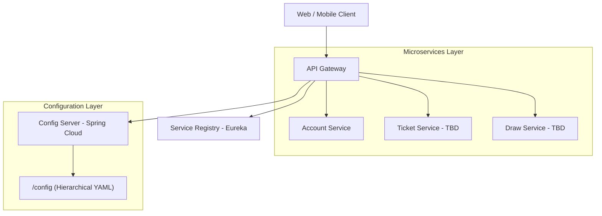

# DaiPhat


**DaiPhat** là một hệ thống quản lý và tham gia xổ số trực tuyến thông minh, được thiết kế để mang lại trải nghiệm tiện lợi, minh bạch và an toàn cho người dùng trên đa nền tảng (Web, Mobile).

---

## 📌 1. Tổng quan dự án

Dự án này nhằm mục tiêu hiện đại hóa các quy trình mua và quản lý vé số truyền thống, tích hợp các công cụ phân tích thông minh và giao diện người dùng thân thiện.

### Các đặc điểm chính:
- **Đa nền tảng:** Hỗ trợ trên Web (ReactJS) và Mobile (Flutter).
- **Kiến trúc Microservices:** Hệ thống backend mạnh mẽ, linh hoạt và dễ mở rộng.
- **Tiện lợi:** Tích hợp thanh toán và quản lý vé tự động.
- **Thông báo:** Cập nhật kết quả nhanh chóng qua ứng dụng di động.

---

## 🏗️ 2. Kiến trúc hệ thống (System Architecture)

Hệ thống được phát triển theo mô hình Microservices kiến trúc hướng dịch vụ với hạ tầng quản lý tập trung:



---

## 🚀 3. Chạy local bằng Docker Compose

Yêu cầu duy nhất là Docker Desktop/Docker Engine có hỗ trợ Compose. Từ thư mục gốc repository:

```bash
docker compose up -d --build
```

Sau khi các service healthy:

- Backend/Swagger: http://localhost:8080/swagger-ui/index.html
- PostgreSQL: `localhost:5434`
- Redis: `localhost:6380`

Backend chạy dev mode trong container và tự khởi động lại khi source thay đổi. Access token của local được giữ ở 5 giây để test refresh token và WebSocket.

Frontend chạy riêng ngoài Docker:

```bash
cd daiphat-fe
npm install
npm run dev
```

Dừng hệ thống nhưng giữ dữ liệu local:

```bash
docker compose down
```

Chỉ dùng lệnh sau khi thật sự muốn xóa toàn bộ database/volume local:

```bash
docker compose down -v
```

Compose được chuẩn hoá ở root:

- `docker-compose.yml`: local app (FE build + Spring Boot trong một image, kèm PostgreSQL và Redis).
- `docker-compose.uat.yml`: UAT, dùng image đã publish và dịch vụ Neon/Upstash bên ngoài.
- `docker-compose.prod.yml`: production, cùng image và cấu trúc UAT nhưng secrets/URL Prod.

Azure App Service không chạy Compose: nó pull đúng `APP_IMAGE` và nhận cùng biến môi trường qua App Settings. Hai file UAT/Prod giữ lại để preflight image hoặc làm phương án chạy trên VM.

Health check dùng `GET /actuator/health/readiness`; cấu hình Azure App Service Health check theo path này để SMTP ngoài không làm instance bị đánh dấu down.

### Profiles cấu hình backend

- `application.yml`: cấu hình dùng chung; không chọn profile và không có `${VAR:fallback}`.
- `application-local.yml`: hạ tầng và policy dành riêng cho local; được phép hardcode.
- `application-staging.yml`: profile dùng cho UAT, mọi credential/runtime value phải đến từ environment.
- `application-prod.yml`: production, đọc environment do root `.env` hoặc CI/CD cung cấp.

Các file `.env*` runtime đều bị Git ignore. Dùng `.env.uat.example` và `.env.prod.example` làm mẫu; secrets thật đặt ở App Settings Azure hoặc secret store. Các biến dùng prefix (`CORE_`, `AUTH_`, `VITE_`) để nhìn ra phạm vi sử dụng.

## Backend setup thủ công (tùy chọn)

Phân hệ BE của DaiPhat được xây dựng trên nền tảng **Spring Boot (JDK 21)** và **Spring Cloud**, quản lý theo mô hình **Monorepo** với Parent POM tập trung.

#### 📁 Cấu trúc thư mục Backend:
- **`daiphat-be/`**: Thư mục gốc chứa toàn bộ các service.
    - `pom.xml`: **Parent POM** quản lý version và Checkstyle chung.
    - `config-server/`: Service quản lý cấu hình tập trung (Port 8888).
    - `discovery-server/`: Eureka Server (Port 8761).
    - `api-gateway-service/`: API Gateway (Port 8080).
    - `config/`: Thư mục chứa các file cấu hình `.yml` phân cấp cho từng service.

#### 📋 Yêu cầu hệ thống:
*   **JDK 21** (Amazon Corretto hoặc Oracle OpenJDK).
*   **Maven 3.9+** (Dùng để build services).
*   **Docker & Docker Compose** (Dùng để chạy hạ tầng).

#### 🛠️ Bước 1: Build & Cài đặt Backend
Sử dụng Maven tại thư mục gốc `daiphat-be` để chuẩn bị môi trường:

```bash
cd daiphat-be

# Build toàn bộ dự án & cài đặt dependencies (Skip tests)
mvn clean install -DskipTests

# Kiểm tra chất lượng code (Checkstyle)
mvn checkstyle:check
```

#### 🐳 Bước 2: Khởi chạy Hạ tầng (Docker Compose)
Dùng Docker để bật nhanh các cột trụ hạ tầng phục vụ việc phát triển local:

**A. Chỉ chạy Hạ tầng (Để code tay trên IDE - Khuyên dùng):**
```bash
# Mặc định sẽ chỉ bật Postgres, Redis, RabbitMQ
docker compose up -d
```

**B. Triển khai Tổng lực (Full Stack - Dùng cho VPS/Test Prod):**
```bash
# Chạy cả Microservices + Hạ tầng bằng file Pro
docker compose -f docker-compose.prod.yml up -d --build
```

#### 🏃 Bước 3: Thứ tự chạy các Service (Local Run trên IDE)
Khi chạy trên IDE (IntelliJ/VS Code), bạn nên tuân thủ thứ tự:

1.  **Discovery Server**: (Port 8761)
2.  **Config Server**: (Port 8888)
3.  **API Gateway**: (Port 8080)
4.  **Các Microservices**: (Vd: `account-service` Port 8081)

---

## 💻 4. Quy trình phát triển (Development Workflow)

#### 🌿 Quy tắc đặt tên nhánh (Branching Policy)
*   🔥 **`main`**: Bản Release chính thức. Tuyệt đối không commit trực tiếp.
*   🛠️ **`develop`**: Nhánh chính để tích hợp các tính năng mới.
*   🌿 **`feature/SLT-XX-[topic]`**: Nhánh tính năng dựa trên Jira Task ID.

#### 📝 Quy chuẩn Commit (Commit Messages)
Team tuân thủ **Conventional Commits**: `[TASK-ID] [type](scope): [description] #done`

---

## 🚢 5. Quy trình CI/CD & Chất lượng Code

Dự án áp dụng tiêu chuẩn chất lượng nghiêm ngặt thông qua **Checkstyle** và **GitHub Actions**.

#### 🛠️ Kiểm tra chất lượng (Code Linting):
*   **Công cụ:** `checkstyle.xml` (Đã cấu hình: 4 spaces, cho phép star imports).
*   **Thực thi:** `mvn checkstyle:check` (Chạy tại root `daiphat-be` sẽ quét toàn bộ service).
*   **Quy tắc:** Mọi vi phạm style đều làm build bị lỗi ở bước CI.

---

## 🛠 6. Công nghệ và Công cụ (Tech Stack)

### Nền tảng (Tech Stack):
- **Backend:** Java 21, Spring Boot 3.x, Spring Cloud.
- **Web Frontend:** ReactJS + TypeScript + Tailwind CSS.
- **Mobile App:** Flutter.
- **Database:** Đang cân nhắc giữa SQL Server và PostgreSQL.
- **Configuration:** Spring Cloud Config (FileSystem Native).

---

## 📞 7. Hỗ trợ & Liên hệ

- Dự án được phát triển bởi đội ngũ DaiPhat.
- Quản lý công việc qua: [Jira - DaiPhat](https://jira.atlassian.com).
