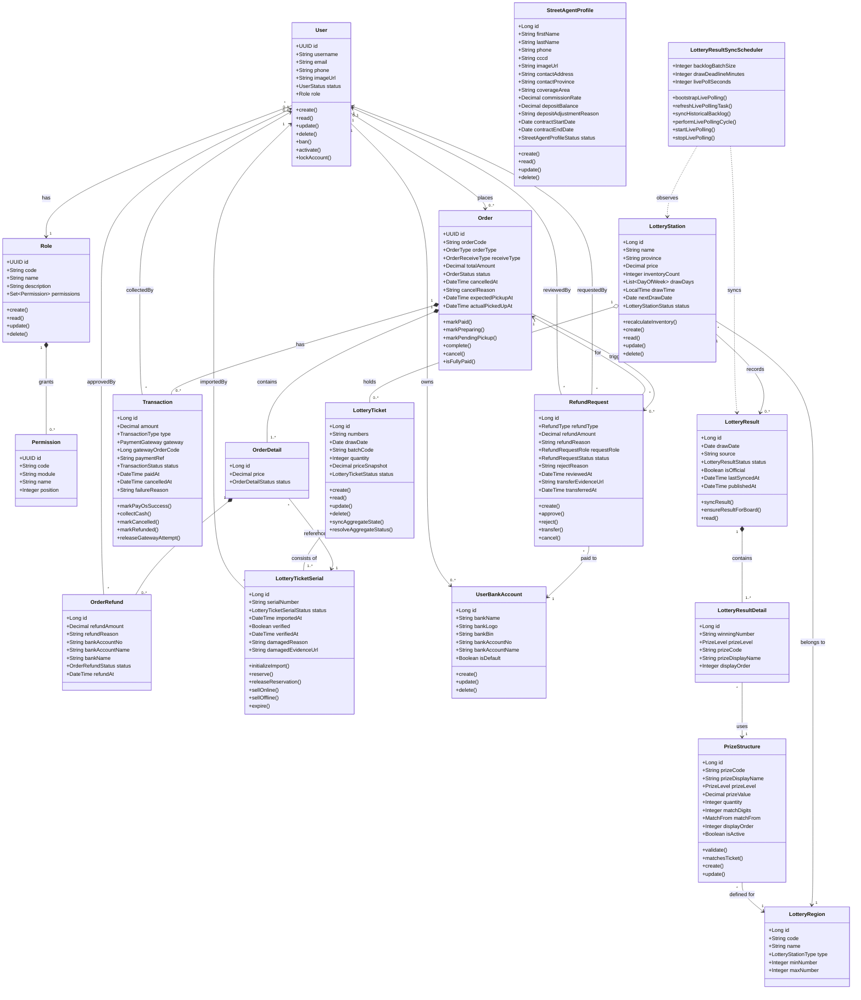

# Class Diagram — DaiPhat Lottery Platform

> **7 luồng nghiệp vụ lõi** (bỏ luồng Giao hàng):
> 1. Đặt hàng & thanh toán online · 2. Mua vé tại quầy · 4. Nhập kho vé
> 5. Yêu cầu & xử lý hoàn tiền · 6. Bán vé qua street agent
> 7. Đối soát & trả thưởng · 8. Đồng bộ kết quả xổ số

---

## Enums tham chiếu

| Enum | Giá trị |
|------|---------|
| `UserStatus` | ACTIVE · PENDING · LOCKED · BANNED · DELETED |
| `OrderType` | ONLINE · DIRECT |
| `OrderStatus` | PENDING_PAYMENT · PAID · PREPARING · PENDING_PICKUP · COMPLETED · CANCELLED |
| `OrderDetailStatus` | ACTIVE · INACTIVE · REFUND_PENDING · REFUNDED |
| `TransactionType` | ONLINE · OFFLINE |
| `TransactionStatus` | PENDING · COMPLETED · FAILED · CANCELLED · REFUNDED |
| `PaymentGateway` | PAYOS |
| `OrderRefundStatus` | PENDING · APPROVED · REJECTED |
| `LotteryStationStatus` | DRAFT · PENDING_APPROVAL · ACTIVE · INACTIVE |
| `LotteryTicketStatus` | IN_STOCK · SOLD_OUT · EXPIRED · RESERVED · SOLD · PROXY_HOLDING · PENDING_RETURN · RETURNED · INTERNAL_FAULT · ISSUER_FAULT |
| `LotteryTicketSerialStatus` | IN_STOCK · RESERVED · SOLD · PROXY_HOLDING · PENDING_RETURN · RETURNED · EXPIRED · INTERNAL_FAULT · ISSUER_FAULT |
| `RefundType` | FULL_ORDER · ORDER_DETAIL |
| `RefundRequestStatus` | PENDING · APPROVED · REJECTED · TRANSFERRED · CANCELLED |
| `RefundRequestRole` | CUSTOMER · STAFF · ADMIN |
| `StreetAgentProfileStatus` | ACTIVE · INACTIVE |
| `LotteryResultStatus` | PENDING · DRAWING · PARTIAL · WAITING_FOR_AUDIT · COMPLETED · FAILED |
| `PrizeLevel` | SPECIAL · FIRST · SECOND · THIRD · FOURTH · FIFTH · SIXTH · SEVENTH · EIGHTH · SUB_SPECIAL · CONSOLATION |
| `MatchFrom` | LAST · EXACT · ANY · SPECIAL_CONSOLATION_1 · SPECIAL_CONSOLATION_2 |
