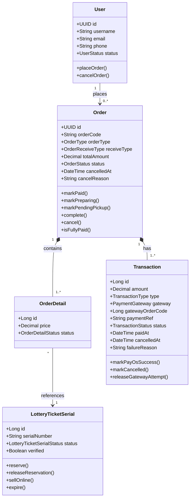
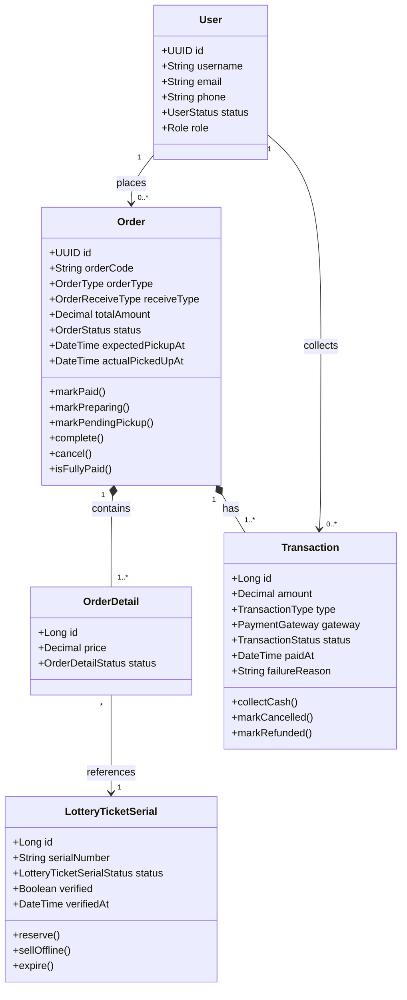
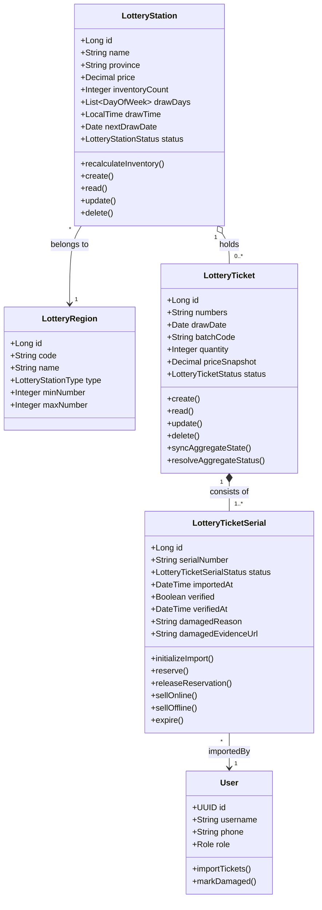
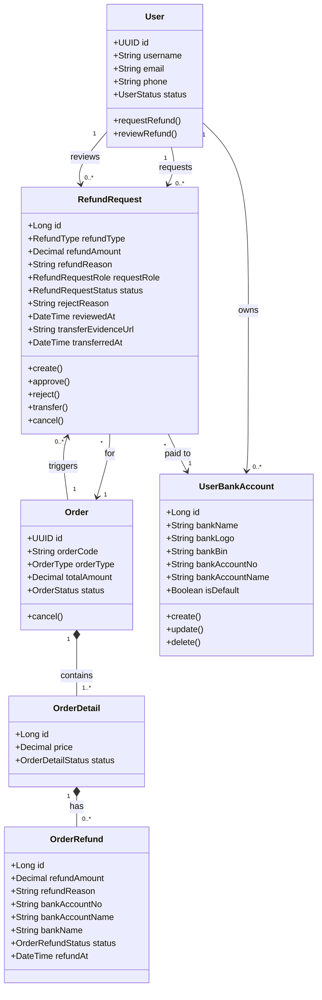
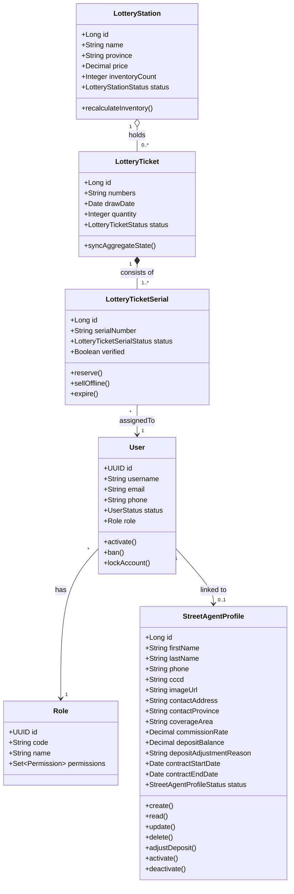
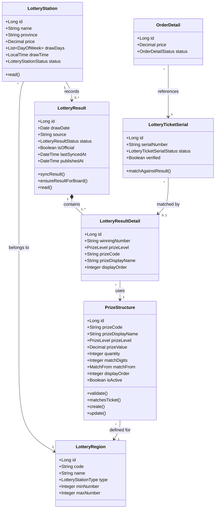
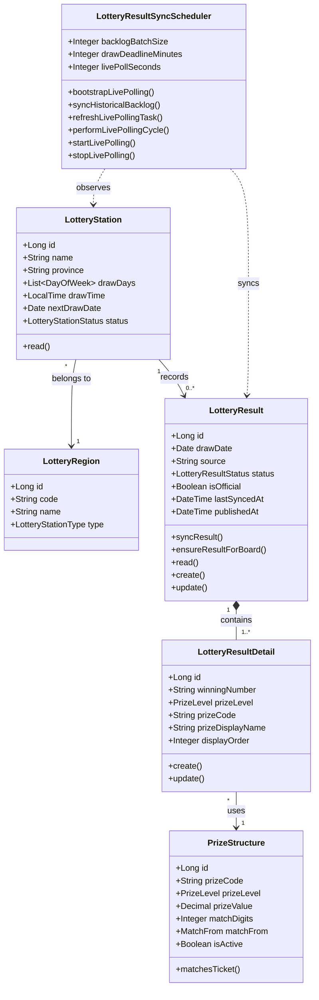

# Class Diagrams — DaiPhat Lottery Platform (All Flows)

> 7 luồng nghiệp vụ lõi · Mỗi block `mermaid` là 1 luồng độc lập · Chèn từng block vào draw.io riêng lẻ

---

## Luồng 1 — Đặt hàng & Thanh toán Online

> **Actors:** Customer, System, PayOS  
> **Mô tả:** Khách chọn vé trên app/web → tạo đơn hàng → thanh toán qua PayOS → hệ thống xác nhận và giao vé.

---

## Luồng 2 — Mua vé tại quầy (Offline)

> **Actors:** Customer, Operator (Staff)  
> **Mô tả:** Khách đến quầy → nhân viên tạo đơn trực tiếp → thu tiền mặt hoặc chuyển khoản → xác nhận QR → giao vé tại chỗ.

---

## Luồng 4 — Nhập kho vé

> **Actors:** Operator, System  
> **Mô tả:** Nhân viên nhập serial vé (scan hoặc thủ công) → hệ thống kiểm tra trùng lặp, ngày mở thưởng, vé hỏng → cập nhật tồn kho.

---

## Luồng 5 — Yêu cầu & Xử lý Hoàn tiền

> **Actors:** Customer, Operator/Admin  
> **Mô tả:** Khách hoặc nhân viên tạo yêu cầu hoàn tiền → Admin/Operator duyệt hoặc từ chối → hệ thống chuyển khoản về tài khoản ngân hàng của khách.

---

## Luồng 6 — Bán vé qua Street Agent

> **Actors:** Vendor/StreetAgent, Operator, System  
> **Mô tả:** Đại lý bán dạo nhận vé từ hệ thống → bán trực tiếp cho khách ngoài thực địa → đối soát doanh số và hoa hồng.

---

## Luồng 7 — Đối soát & Trả thưởng (Prize Payout)

> **Actors:** Customer, Operator/Admin, System  
> **Mô tả:** Sau khi kết quả xổ số công bố → hệ thống đối chiếu serial vé với kết quả → xác định giải thắng → Admin duyệt trả thưởng → chuyển khoản về tài khoản khách.

---

## Luồng 8 — Đồng bộ kết quả xổ số (Auto Sync)

> **Actors:** System (Scheduler)  
> **Mô tả:** Scheduler tự động polling kết quả từ nguồn bên ngoài → lưu vào `LotteryResult` + `LotteryResultDetail` → retry khi nguồn lỗi.

---

## Enums tham chiếu

| Enum | Giá trị |
|------|---------|
| `UserStatus` | ACTIVE · PENDING · LOCKED · BANNED · DELETED |
| `OrderType` | ONLINE · DIRECT |
| `OrderReceiveType` | PICKUP · DELIVERY |
| `OrderStatus` | PENDING_PAYMENT · PAID · PREPARING · PENDING_PICKUP · COMPLETED · CANCELLED |
| `OrderDetailStatus` | ACTIVE · INACTIVE · REFUND_PENDING · REFUNDED |
| `TransactionType` | ONLINE · OFFLINE |
| `TransactionStatus` | PENDING · COMPLETED · FAILED · CANCELLED · REFUNDED |
| `PaymentGateway` | PAYOS |
| `OrderRefundStatus` | PENDING · APPROVED · REJECTED |
| `LotteryStationStatus` | DRAFT · PENDING_APPROVAL · ACTIVE · INACTIVE |
| `LotteryStationType` | MIEN_BAC · MIEN_TRUNG · MIEN_NAM |
| `LotteryTicketStatus` | IN_STOCK · SOLD_OUT · EXPIRED · RESERVED · SOLD · PROXY_HOLDING · PENDING_RETURN · RETURNED · INTERNAL_FAULT · ISSUER_FAULT |
| `LotteryTicketSerialStatus` | IN_STOCK · RESERVED · SOLD · PROXY_HOLDING · PENDING_RETURN · RETURNED · EXPIRED · INTERNAL_FAULT · ISSUER_FAULT |
| `RefundType` | FULL_ORDER · ORDER_DETAIL |
| `RefundRequestStatus` | PENDING · APPROVED · REJECTED · TRANSFERRED · CANCELLED |
| `RefundRequestRole` | CUSTOMER · STAFF · ADMIN |
| `StreetAgentProfileStatus` | ACTIVE · INACTIVE |
| `LotteryResultStatus` | PENDING · DRAWING · PARTIAL · WAITING_FOR_AUDIT · COMPLETED · FAILED |
| `PrizeLevel` | SPECIAL · FIRST · SECOND · THIRD · FOURTH · FIFTH · SIXTH · SEVENTH · EIGHTH · SUB_SPECIAL · CONSOLATION |
| `MatchFrom` | LAST · EXACT · ANY · SPECIAL_CONSOLATION_1 · SPECIAL_CONSOLATION_2 |
