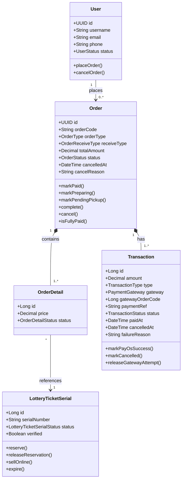

# Luồng 1 — Đặt hàng & Thanh toán Online

> **Actors:** Customer, System, PayOS  
> **Mô tả:** Khách hàng chọn vé trên app/web → tạo đơn hàng → thanh toán qua PayOS → hệ thống xác nhận và giao vé.

---

**Enums liên quan**

| Enum | Giá trị |
|------|---------|
| `OrderType` | ONLINE · DIRECT |
| `OrderStatus` | PENDING_PAYMENT · PAID · PREPARING · PENDING_PICKUP · COMPLETED · CANCELLED |
| `OrderDetailStatus` | ACTIVE · INACTIVE · REFUND_PENDING · REFUNDED |
| `TransactionType` | ONLINE · OFFLINE |
| `TransactionStatus` | PENDING · COMPLETED · FAILED · CANCELLED · REFUNDED |
| `PaymentGateway` | PAYOS |
| `LotteryTicketSerialStatus` | IN_STOCK · RESERVED · SOLD · EXPIRED · ... |
