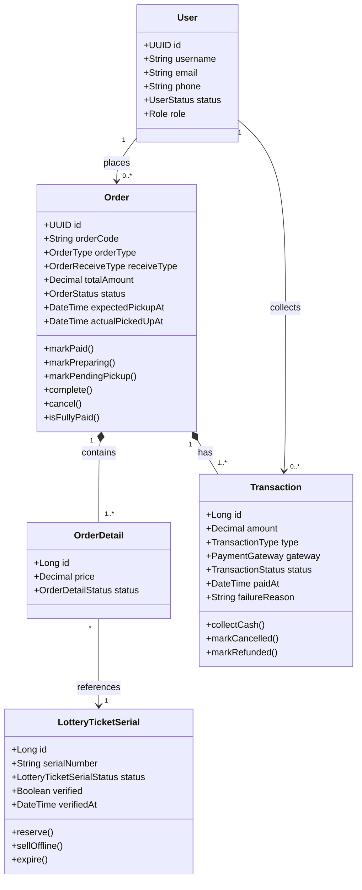

# Luồng 2 — Mua vé tại quầy (Offline)

> **Actors:** Customer, Operator (Staff)  
> **Mô tả:** Khách đến quầy → nhân viên tạo đơn hàng trực tiếp → thu tiền mặt hoặc chuyển khoản → xác nhận QR → giao vé tại chỗ.

---

**Enums liên quan**

| Enum | Giá trị |
|------|---------|
| `OrderType` | **DIRECT** (luồng offline) · ONLINE |
| `OrderReceiveType` | PICKUP · DELIVERY |
| `OrderStatus` | PENDING_PAYMENT · PAID · PREPARING · PENDING_PICKUP · COMPLETED · CANCELLED |
| `TransactionType` | **OFFLINE** (luồng offline) · ONLINE |
| `TransactionStatus` | PENDING · COMPLETED · FAILED · CANCELLED · REFUNDED |
| `LotteryTicketSerialStatus` | IN_STOCK · RESERVED · SOLD · EXPIRED · ... |
