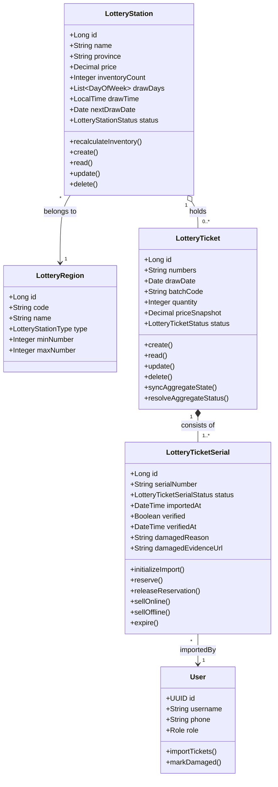

# Luồng 4 — Nhập kho vé

> **Actors:** Operator, System  
> **Mô tả:** Nhân viên nhập serial vé (scan hoặc thủ công) → hệ thống kiểm tra trùng lặp, ngày mở thưởng, vé hỏng → cập nhật tồn kho.

---

**Enums liên quan**

| Enum | Giá trị |
|------|---------|
| `LotteryStationStatus` | DRAFT · PENDING_APPROVAL · ACTIVE · INACTIVE |
| `LotteryTicketStatus` | IN_STOCK · SOLD_OUT · EXPIRED · RESERVED · SOLD · PROXY_HOLDING · PENDING_RETURN · RETURNED · INTERNAL_FAULT · ISSUER_FAULT |
| `LotteryTicketSerialStatus` | IN_STOCK · RESERVED · SOLD · PROXY_HOLDING · PENDING_RETURN · RETURNED · EXPIRED · INTERNAL_FAULT · ISSUER_FAULT |
| `LotteryStationType` | MIEN_BAC · MIEN_TRUNG · MIEN_NAM |
