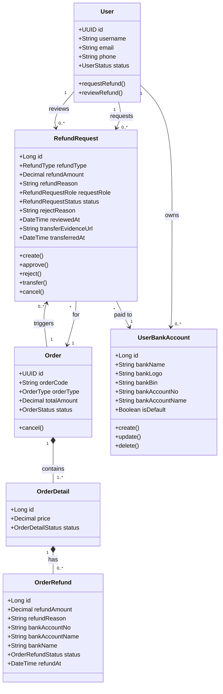

# Luồng 5 — Yêu cầu & Xử lý Hoàn tiền

> **Actors:** Customer, Operator/Admin  
> **Mô tả:** Khách hoặc nhân viên tạo yêu cầu hoàn tiền → Admin/Operator duyệt hoặc từ chối → hệ thống chuyển khoản về tài khoản ngân hàng của khách.

---

**Enums liên quan**

| Enum | Giá trị |
|------|---------|
| `RefundType` | FULL_ORDER · ORDER_DETAIL |
| `RefundRequestStatus` | PENDING · APPROVED · REJECTED · TRANSFERRED · CANCELLED |
| `RefundRequestRole` | CUSTOMER · STAFF · ADMIN |
| `OrderRefundStatus` | PENDING · APPROVED · REJECTED |
| `OrderDetailStatus` | ACTIVE · INACTIVE · REFUND_PENDING · REFUNDED |
