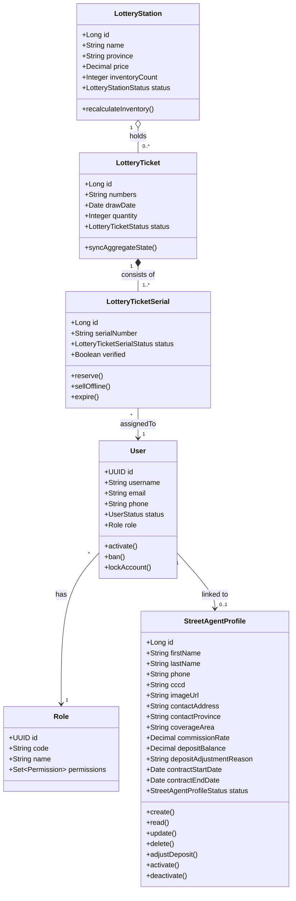

# Luồng 6 — Bán vé qua Street Agent

> **Actors:** Vendor/StreetAgent, Operator, System  
> **Mô tả:** Đại lý bán dạo nhận vé từ hệ thống → bán trực tiếp cho khách ngoài thực địa → đối soát doanh số và hoa hồng.

---

**Enums liên quan**

| Enum | Giá trị |
|------|---------|
| `StreetAgentProfileStatus` | ACTIVE · INACTIVE |
| `UserStatus` | ACTIVE · PENDING · LOCKED · BANNED · DELETED |
| `LotteryTicketSerialStatus` | IN_STOCK · RESERVED · SOLD · PROXY_HOLDING · PENDING_RETURN · RETURNED · EXPIRED · INTERNAL_FAULT · ISSUER_FAULT |
