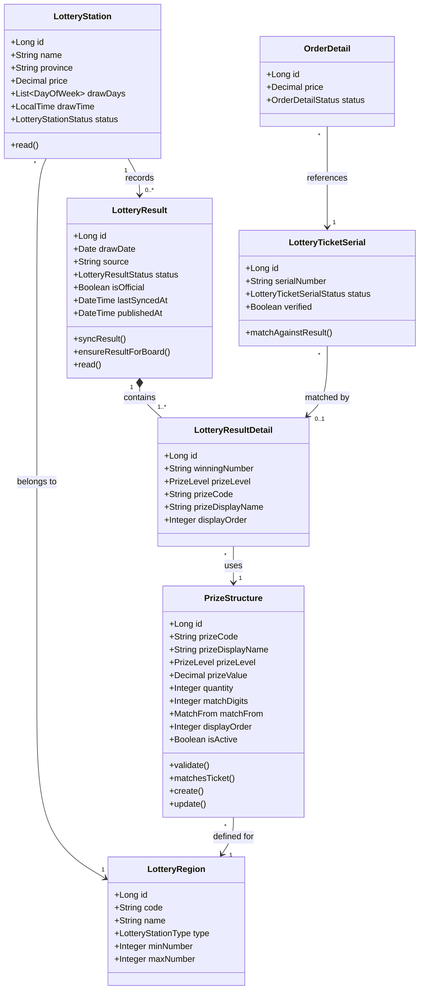

# Luồng 7 — Đối soát & Trả thưởng (Prize Payout)

> **Actors:** Customer, Operator/Admin, System  
> **Mô tả:** Sau khi kết quả xổ số được công bố → hệ thống đối chiếu serial vé với kết quả → xác định giải thắng → Admin duyệt trả thưởng → chuyển khoản về tài khoản khách.

---

**Enums liên quan**

| Enum | Giá trị |
|------|---------|
| `LotteryResultStatus` | PENDING · DRAWING · PARTIAL · WAITING_FOR_AUDIT · COMPLETED · FAILED |
| `PrizeLevel` | SPECIAL · FIRST · SECOND · THIRD · FOURTH · FIFTH · SIXTH · SEVENTH · EIGHTH · SUB_SPECIAL · CONSOLATION |
| `MatchFrom` | LAST · EXACT · ANY · SPECIAL_CONSOLATION_1 · SPECIAL_CONSOLATION_2 |
| `LotteryStationType` | MIEN_BAC · MIEN_TRUNG · MIEN_NAM |
