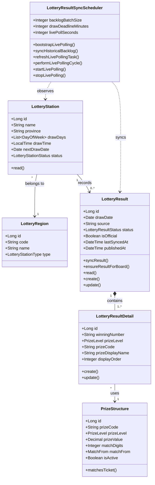

# Luồng 8 — Đồng bộ kết quả xổ số (Auto Sync)

> **Actors:** System (Scheduler)  
> **Mô tả:** Scheduler tự động polling kết quả xổ số từ nguồn bên ngoài → lưu vào `LotteryResult` + `LotteryResultDetail` → retry khi nguồn lỗi.

---

**Enums liên quan**

| Enum | Giá trị |
|------|---------|
| `LotteryResultStatus` | PENDING · DRAWING · PARTIAL · WAITING_FOR_AUDIT · COMPLETED · FAILED |
| `LotteryStationStatus` | DRAFT · PENDING_APPROVAL · ACTIVE · INACTIVE |
| `PrizeLevel` | SPECIAL · FIRST · SECOND · THIRD · FOURTH · FIFTH · SIXTH · SEVENTH · EIGHTH · SUB_SPECIAL · CONSOLATION |
| `MatchFrom` | LAST · EXACT · ANY · SPECIAL_CONSOLATION_1 · SPECIAL_CONSOLATION_2 |
