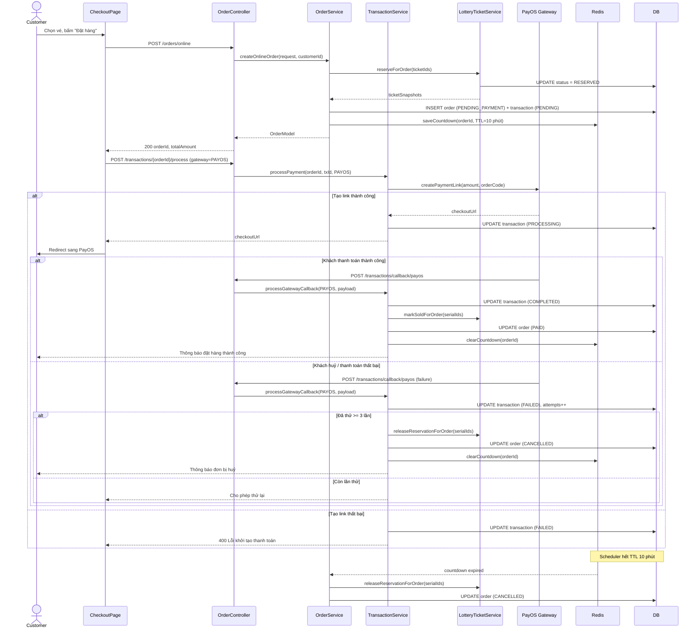
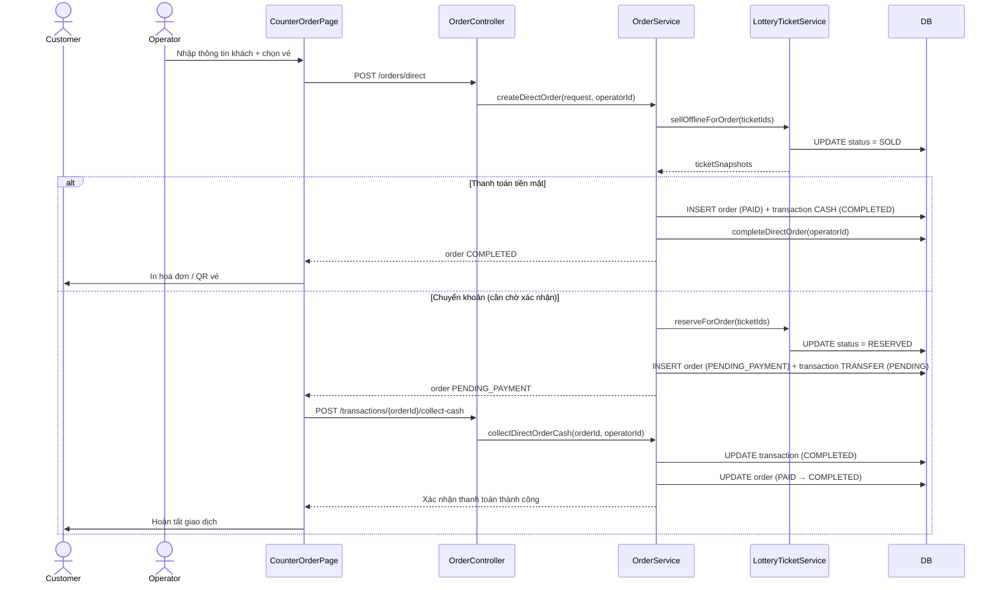
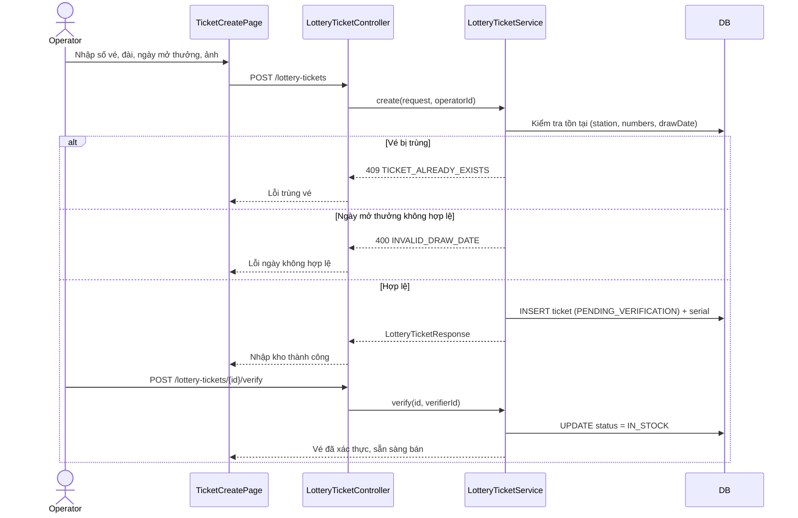
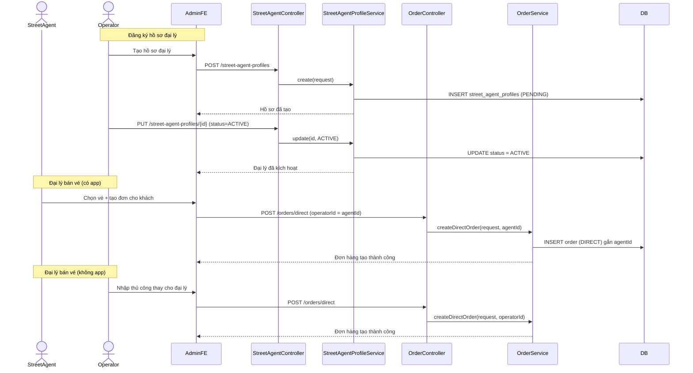
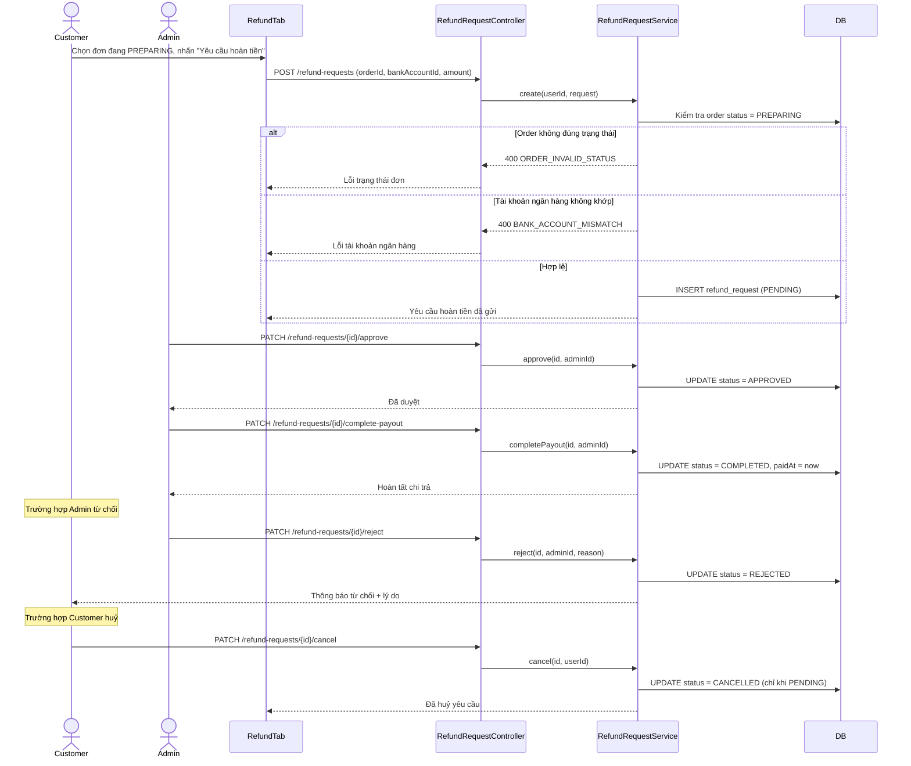
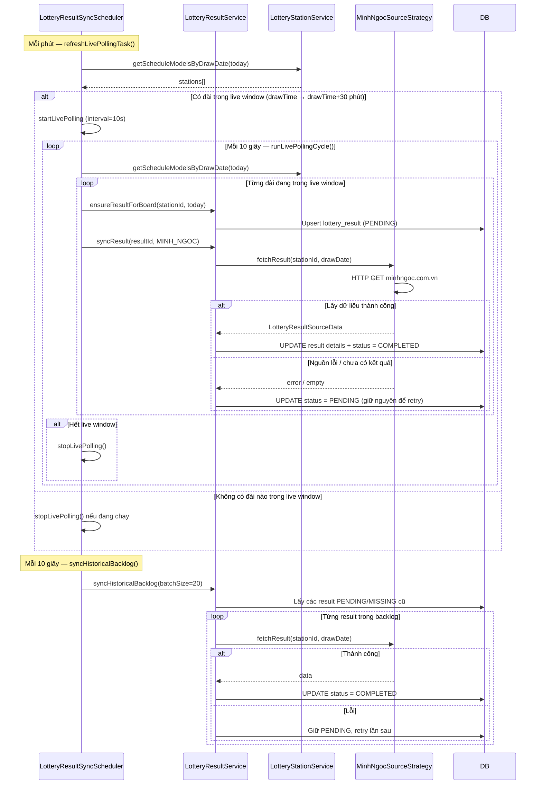
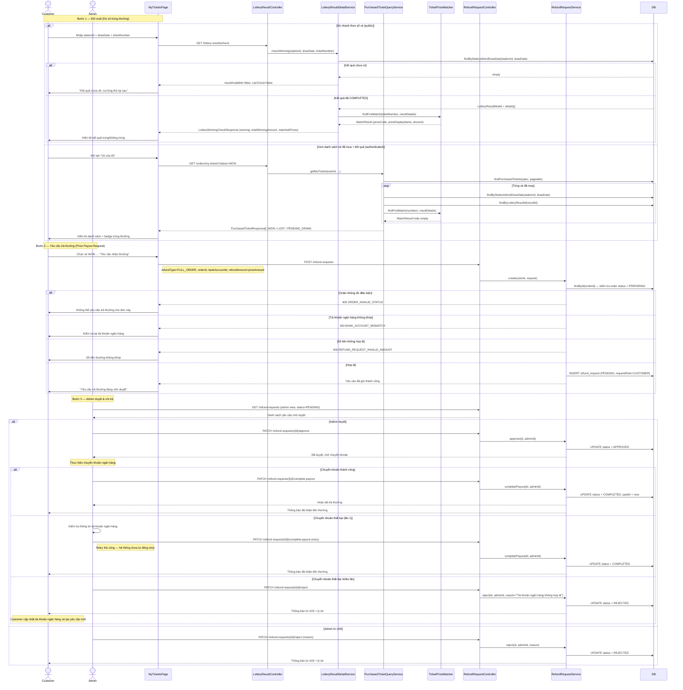

# DaiPhat Lottery Platform — Sequence Diagrams

---

## 1. Đặt hàng & thanh toán online

---

## 2. Mua vé tại quầy (offline)

---

## 3. Nhập kho vé (scan / nhập tay)

---

## 4. Bán vé qua người bán dạo (Street Agent)

---

## 5. Yêu cầu & xử lý hoàn tiền

---

## 6. Đồng bộ kết quả xổ số (Tự động)

---

## 7. Đối soát & Trả thưởng (Prize Payout)

---

## Trạng thái chính của các entity

| Entity | Trạng thái |
|---|---|
| LotteryTicket | `IN_STOCK` → `RESERVED` → `SOLD` / `EXPIRED` |
| Order | `PENDING_PAYMENT` → `PAID` → `PREPARING` → `PENDING_PICKUP` → `COMPLETED` / `CANCELLED` |
| Transaction | `PENDING` → `COMPLETED` / `FAILED` / `CANCELLED` |
| RefundRequest | `PENDING` → `APPROVED` → `COMPLETED` / `REJECTED` / `CANCELLED` |
| LotteryResult | `PENDING` → `COMPLETED` |
| StreetAgentProfile | `PENDING` → `ACTIVE` / `INACTIVE` |
