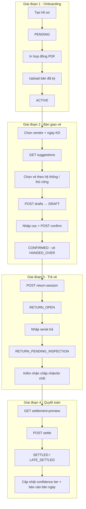

# Luồng nghiệp vụ Người bán vé số (Street Agent)

> Tài liệu tổng hợp FE + BE — cập nhật theo branch `feature/dp-8-street-agents`.

Đây là luồng **admin/quầy quản lý người bán vé dạo** — không phải app đăng nhập của người bán. Hệ thống quản lý: hồ sơ → hợp đồng → bàn giao vé từ kho → nhận cọc → trả vé → kiểm nhận → quyết toán.

---

## 1. Tổng quan module

| Layer | Vị trí |
|-------|--------|
| **FE** | `daiphat-fe/src/admin/features/street-agent/` |
| **Routes** | `/admin/street-agent/*` |
| **BE API** | `/api/v1/street-agent-profiles`, `/api/v1/vendor-allocations`, `/api/v1/lucky-pattern-configs` |
| **Tài liệu BE chi tiết** | `daiphat-be/core-api/docs/vendor-allocation-flow-report.md` |

---

## 2. Các trang admin & vai trò

| Trang | Route | Component | Mục đích |
|-------|-------|-----------|----------|
| Danh sách hồ sơ | `/admin/street-agent/list` | `StreetAgentListPage` | Xem/lọc PENDING/ACTIVE/INACTIVE, sửa, tiếp tục onboarding |
| Tạo hồ sơ | `/admin/street-agent/create` | `StreetAgentCreatePage` | Form 3 bước: thông tin → in HĐ → upload bản ký |
| Sửa hồ sơ | `/admin/street-agent/edit/[id]` | `StreetAgentEditPage` | Cập nhật, khóa/kích hoạt, xem tin cậy & báo cáo bán |
| Bàn giao vé | `/admin/street-agent/allocation` | `VendorAllocationPage` | Gợi ý vé, chọn, tạo nháp, xác nhận cọc |
| Phiếu bàn giao | `/admin/street-agent/allocation/batches` | `VendorAllocationBatchListPage` | Danh sách phiếu, drawer xử lý nhanh |
| Chi tiết phiếu | `/admin/street-agent/allocation/batches/[id]` | `VendorAllocationBatchDetailPage` | Trả vé → kiểm nhận → quyết toán đầy đủ |
| Cấu hình số đẹp | `/admin/street-agent/lucky-patterns` | `LuckyPatternConfigPage` | CRUD pattern, recompute đánh dấu vé lucky |
| PDF hợp đồng | `/admin/street-agent/contract/[id]` | API route | Stream PDF hợp đồng (proxy BE) |

**Sidebar:** Nhóm *Người bán vé số* (Hồ sơ, Bàn giao vé, Phiếu bàn giao) + *Vé số* → Cấu hình số đẹp.

**Deep-link query params:**

| Trang | Params |
|-------|--------|
| Create | `?resumeId={id}` — tiếp tục onboarding PENDING |
| Allocation | `profileId`, `businessDate`, `draftId`, `faceValue` |
| Batch list | `batchId` — mở drawer chi tiết |

---

## 3. Luồng nghiệp vụ end-to-end



---

## 4. Domain entities & trạng thái (BE)

### 4.1 Hồ sơ — `StreetAgentProfile`

| Thành phần | File |
|------------|------|
| Entity | `StreetAgentProfileEntity` |
| Service | `StreetAgentProfileService` |
| Controller | `StreetAgentProfileController` |
| Bảng | `street_agent_profiles` |

**Trạng thái profile (`StreetAgentProfileStatus`):**

| Status | Ý nghĩa |
|--------|---------|
| `PENDING` | Chờ hoàn thiện hợp đồng |
| `ACTIVE` | Đủ điều kiện vận hành |
| `INACTIVE` | Ngưng hoạt động (thủ công) |

**Trường nghiệp vụ quan trọng:** `userId`, hợp đồng (`contractCode`, dates, `contractMaxDailyCap`, `contractDocumentUrl`), `commissionRate`, `confidenceScore/Tier`, `depositBalance`.

**Lifecycle:**

```
PENDING ──(upload HĐ ký + hợp đồng còn hiệu lực)──► ACTIVE
ACTIVE  ──(staff set INACTIVE)────────────────────► INACTIVE
ACTIVE  ──(sửa điều khoản HĐ đã ký)───────────────► PENDING (phải ký lại)
```

**Điều kiện được bàn giao vé:**

1. Không `INACTIVE`
2. Hợp đồng còn hiệu lực theo `businessDate`
3. Có file hợp đồng đã ký
4. `contractMaxDailyCap > 0`
5. `depositBalance = 0` (không còn cọc legacy)
6. Không có batch mở (`DRAFT` / `CONFIRMED` / `RETURN_OPEN`)

### 4.2 Phiếu bàn giao — `AllocationBatch`

| Thành phần | File |
|------------|------|
| Entity | `AllocationBatchEntity`, `AllocationBatchDetailEntity` |
| Service | `VendorAllocationService` |
| Controller | `VendorAllocationController` |
| Bảng | `allocation_batches`, `allocation_batch_details` |

**Trạng thái batch (`AllocationBatchStatus`):**

| Status | Ý nghĩa |
|--------|---------|
| `DRAFT` | Nháp, giữ serial theo TTL |
| `CONFIRMED` | Đã bàn giao, nhận cọc |
| `RETURN_OPEN` | Đang mở phiên nhận trả |
| `SETTLED` | Quyết toán đúng hạn |
| `LATE_SETTLED` | Quyết toán trễ (sau cutoff) |
| `CANCELLED` | Hủy nháp |
| `EXPIRED` | Hết TTL / quá giờ quay |

**Ràng buộc:** Mỗi vendor chỉ **một phiếu mở** tại một thời điểm (unique index DB).

**Lifecycle batch:**

```
                    ┌──────── CANCELLED (hủy thủ công)
                    │
[Suggestion] → DRAFT ─┼──────── EXPIRED (TTL / quá giờ quay)
                    │              ↓ nhả serial → IN_STOCK/EXPIRED
                    ↓ confirm + nhận cọc
               CONFIRMED
                    ↓ openReturnSession
               RETURN_OPEN
                    ↓ recordReturns → RETURN_PENDING_INSPECTION
                    ↓ confirmReturnInspection → RETURNED / RETURN_REJECTED
                    ↓ previewSettlement + settle
          SETTLED (đúng hạn) / LATE_SETTLED (sau cutoff)
```

### 4.3 Serial trong batch — `AgentTicketStock`

**Trạng thái serial allocation (`AllocationSerialStatus`):**

```
DRAFT_RESERVED → HANDED_OVER → RETURN_PENDING_INSPECTION
                                    ↓
                          RETURNED (trả OK) / RETURN_REJECTED (từ chối)
                                    ↓
                              SOLD (khi quyết toán)
```

**Đồng bộ kho gốc (`lottery_ticket_serials`):**

`IN_STOCK` → `RESERVED` (draft) → `WITH_STREET_AGENT` (confirm) → `IN_STOCK` (trả OK) / `SOLD` (settle) / `EXPIRED`

### 4.4 Confidence tier — `VendorConfidenceTier`

```
NEW → DEVELOPING → ESTABLISHED → TRUSTED
```

Tính từ các batch terminal (`SETTLED` / `LATE_SETTLED`):

- **onTimeRate** — tỷ lệ settle đúng hạn
- **sellThroughRate** — vé bán / vé giao
- **experienceRate** — số batch trong cửa sổ

Ngưỡng và % cap theo tier lấy từ `SystemConfigEnum` (`VENDOR_CONFIDENCE_*`). Tier ảnh hưởng **% hạn mức ngày thực tế**, không đổi `contractMaxDailyCap` trên hợp đồng.

### 4.5 Lucky pattern

| Thành phần | Vai trò |
|------------|---------|
| `LuckyPatternConfigEntity` | Cấu hình pattern |
| `LuckyPatternMatcher` | Đánh dấu serial |
| `LuckyPatternType` | `EXACT`, `DIGIT_MATCH` |
| `LuckyMatchPosition` | `PREFIX`, `SUFFIX`, `ANYWHERE` |

Vé lucky mặc định **không** phân bổ cho vendor; cần quyền `streetAgent:manage` + lý do override.

---

## 5. Chi tiết từng giai đoạn

### Giai đoạn 1 — Tạo & kích hoạt hồ sơ

**UI:** `StreetAgentCreatePage` + `StreetAgentProfileForm`

| Bước | UI | API |
|------|-----|-----|
| 0 | Form thông tin | `POST /street-agent-profiles` → `PENDING` |
| 1 | In & ký HĐ | `GET /street-agent-profiles/{id}/contract/pdf` |
| 2 | Upload bản ký | `POST /street-agent-profiles/{id}/contract/signed-document` → `ACTIVE` |

- Tạo profile → tự tạo `User` nội bộ (không credential)
- `commissionRate` lấy từ config `VENDOR_COMMISSION_RATE`
- `contractMaxDailyCap` mặc định từ `VENDOR_DEFAULT_CONTRACT_MAX_DAILY_CAP`
- Sinh `contractCode` dạng `HD-CTV-{date}-{ref}`

Từ danh sách, hồ sơ PENDING chưa có `contractDocumentUrl` → action **"Hoàn thiện HĐ"** → `create?resumeId={id}`.

### Giai đoạn 2 — Bàn giao vé

**UI:** `VendorAllocationPage`

1. Chọn người bán + **ngày kinh doanh** (`AdminDatePicker`)
2. `GET /vendor-allocations/suggestions` — BE tính hạn mức, kho từng đài, chừa quầy, chặn lucky
3. Chọn số lượng, mệnh giá (nếu nhiều), chế độ **Chọn theo hệ thống / thủ công**
4. Override số đẹp: cần `streetAgent:manage` + lý do
5. `POST /vendor-allocations/drafts` → `DRAFT`, giữ serial (TTL: `VENDOR_DRAFT_RESERVATION_TTL_MINUTES`)
6. Trong thời gian nháp: countdown, hủy hoặc xác nhận
7. **Xác nhận** (`ConfirmVendorDepositDialog`):
   - `GET /vendor-allocations/{id}/confirmation-quote` (fingerprint)
   - Nhập tiền cọc thực nhận
   - `POST /vendor-allocations/{id}/confirm` → `CONFIRMED`

**Công thức cọc:**

- Giá vendor = `faceValue × (1 - commissionRate)`
- Cọc yêu cầu = `số vé × giá vendor × depositRate`

**Quy tắc suggestion:**

- Một batch **một mệnh giá**; nhiều mệnh giá → FE chọn `faceValue`
- Mỗi đài giữ stock cho quầy: `STREET_AGENT_COUNTER_RESERVE_*`
- Cap hiệu lực = `floor(contractMaxDailyCap × capPercentage[tier])`

### Giai đoạn 3 — Trả vé

**UI:** `VendorAllocationBatchDetailPage` (stepper 3 bước, server-driven qua `returnWorkflow`)

| Bước | Stage | API |
|------|-------|-----|
| 1 | `RETURN_ENTRY` | `POST /return-session` (CONFIRMED → RETURN_OPEN) |
| | | `POST /returns` — serial `HANDED_OVER` → `RETURN_PENDING_INSPECTION` |
| 2 | `INSPECTION` | `POST /return-inspection/confirm` — chấp nhận/từ chối |
| 3 | `READY_FOR_SETTLEMENT` | `GET /settlement-preview` → `POST /settle` |

Return batch vendor: `ReturnBatchType.STREET_AGENT_RETURN`, gắn `source_allocation_batch_id`.

### Giai đoạn 4 — Quyết toán

**Chính sách trễ hạn (`VendorLateReturnPolicy`):**

| Policy | Đúng hạn | Trễ hạn |
|--------|----------|---------|
| `FORFEIT_DEPOSIT` | Hoàn cọc; nộp tiền mặt = giá bán × số bán | Mất cọc |
| `FORCE_PURCHASE_ALL` | — | Buộc mua hết batch; cọc cấn trừ |

**Settle bị chặn nếu:**

- Còn serial `RETURN_PENDING_INSPECTION`
- Return batch chưa `RECEIVED`
- Fingerprint preview không khớp
- Batch đã settled

Sau settle: cập nhật `agent_settlements`, `daily_sales_reports`, recalc confidence.

---

## 6. API endpoints (BE)

Base: `/api/v1`

### Hồ sơ — `StreetAgentProfileController`

| Method | Endpoint | Quyền | Mục đích |
|--------|----------|-------|----------|
| GET | `/street-agent-profiles` | view | Danh sách |
| GET | `/street-agent-profiles/{id}` | view | Chi tiết |
| POST | `/street-agent-profiles` | create | Tạo PENDING |
| PUT | `/street-agent-profiles/{id}` | edit | Cập nhật |
| DELETE | `/street-agent-profiles/{id}` | delete | Soft delete |
| GET | `/street-agent-profiles/{id}/confidence` | view | Điểm tin cậy |
| GET | `/street-agent-profiles/{id}/daily-sales-reports` | view | BC bán |
| GET | `/street-agent-profiles/{id}/contract/print` | view | HTML HĐ |
| GET | `/street-agent-profiles/{id}/contract/pdf` | view | PDF HĐ |
| POST | `/street-agent-profiles/{id}/contract/signed-document` | edit | Upload HĐ ký |

### Bàn giao — `VendorAllocationController`

| Giai đoạn | Method | Endpoint | Quyền |
|-----------|--------|----------|-------|
| Chuẩn bị | GET | `/vendor-allocations/candidates` | view |
| | GET | `/vendor-allocations/suggestions` | view |
| | GET | `/vendor-allocations/open` | view |
| | GET | `/vendor-allocations` | view |
| Draft | POST | `/vendor-allocations/drafts` | edit |
| | GET | `/vendor-allocations/{id}` | view |
| | POST | `/vendor-allocations/{id}/cancel` | edit |
| Confirm | GET | `/vendor-allocations/{id}/confirmation-quote` | view |
| | POST | `/vendor-allocations/{id}/confirm` | **manage** |
| Return | POST | `/vendor-allocations/{id}/return-session` | edit |
| | POST | `/vendor-allocations/{id}/returns` | edit |
| | DELETE | `/vendor-allocations/{id}/returns/{serialId}` | edit |
| | POST | `/vendor-allocations/{id}/return-inspection/confirm` | edit |
| Settle | GET | `/vendor-allocations/{id}/settlement-preview` | view |
| | POST | `/vendor-allocations/{id}/settle` | **manage** |

### Số đẹp — `LuckyPatternConfigController`

| Method | Endpoint |
|--------|----------|
| GET | `/lucky-pattern-configs` |
| POST | `/lucky-pattern-configs` |
| PUT | `/lucky-pattern-configs/{id}` |
| POST | `/lucky-pattern-configs/recompute` |

---

## 7. FE — Services & Hooks

### Services

**`streetAgentService.ts`** — base `/street-agent-profiles`

| Function | Endpoint |
|----------|----------|
| `getStreetAgentProfiles` | GET `/street-agent-profiles` |
| `getStreetAgentProfileById` | GET `/{id}` |
| `createStreetAgentProfile` | POST |
| `updateStreetAgentProfile` | PUT `/{id}` |
| `getStreetAgentConfidence` | GET `/{id}/confidence` |
| `listStreetAgentDailySalesReports` | GET `/{id}/daily-sales-reports` |
| `uploadStreetAgentSignedContract` | POST `/{id}/contract/signed-document` |
| `openStreetAgentContractPrint` | GET `/{id}/contract/pdf` |

**`vendorAllocationService.ts`** — base `/vendor-allocations`

| Function | Endpoint |
|----------|----------|
| `getVendorAllocationSuggestion` | GET `/suggestions` |
| `getOpenVendorAllocationBatch` | GET `/open` |
| `listVendorAllocationBatches` | GET |
| `createVendorAllocationDraft` | POST `/drafts` |
| `getVendorAllocationBatch` | GET `/{id}` |
| `getVendorConfirmationQuote` | GET `/{id}/confirmation-quote` |
| `confirmVendorAllocation` | POST `/{id}/confirm` |
| `cancelVendorAllocation` | POST `/{id}/cancel` |
| `openVendorAllocationReturnSession` | POST `/{id}/return-session` |
| `returnVendorAllocationSerials` | POST `/{id}/returns` |
| `confirmVendorReturnInspection` | POST `/{id}/return-inspection/confirm` |
| `getVendorAllocationSettlementPreview` | GET `/{id}/settlement-preview` |
| `settleVendorAllocation` | POST `/{id}/settle` |

**`luckyPatternService.ts`** — base `/lucky-pattern-configs`

### Hooks chính

| Hook | File | Vai trò |
|------|------|---------|
| `useStreetAgentProfiles`, `useCreate/Update/Upload` | `useStreetAgent.ts` | CRUD hồ sơ |
| `useVendorAllocationSuggestion` | `useVendorAllocation.ts` | Gợi ý bàn giao |
| `useVendorAllocationOpenBatch` | `useVendorAllocation.ts` | Phiếu mở |
| `useCreate/Confirm/Cancel/Settle...` | `useVendorAllocation.ts` | Mutations |
| `useLuckyPatternConfigs` | `useLuckyPattern.ts` | Số đẹp |
| `useVendorSettingsDefaults` | `useVendorSettingsDefaults.ts` | Config VENDOR_* |

Query keys: `src/admin/features/street-agent/constants/queryKeys.ts`

---

## 8. UI components theo bước

### Tạo / sửa hồ sơ
- `StreetAgentProfileForm` — form đa section
- `StreetAgentCreatePage` — Stepper 3 bước
- `StreetAgentEditPage` — edit + confidence panel
- `StreetAgentList` + `column.config.tsx`

### Bàn giao vé
- `VendorAllocationPage` — Autocomplete, `AdminDatePicker`, chips hạn mức
- `AdminTicketCard` — hiển thị vé theo đài
- `VendorAllocationStationDrawer` — chọn serial
- `ConfirmVendorDepositDialog` — xác nhận cọc

### Quản lý phiếu
- `VendorAllocationBatchListPage` — DataGrid + drawer
- `VendorBatchInfoSection`, `VendorBatchDepositSnapshotSection`
- `VendorAllocationBatchDetailPage` — stepper trả/kiểm/settle

### Tin cậy & báo cáo
- `StreetAgentConfidencePanel`
- `StreetAgentDailySalesReportsPanel`

---

## 9. Phân quyền

| Permission | Code | Dùng cho |
|------------|------|----------|
| Xem | `streetAgent:view` | Vào tất cả route, sidebar |
| Tạo | `streetAgent:create` | Tạo hồ sơ, tạo draft bàn giao |
| Sửa | `streetAgent:edit` | Sửa hồ sơ, hủy nháp, trả vé, kiểm nhận |
| Quản lý | `streetAgent:manage` | Override số đẹp, **xác nhận bàn giao** (nhận cọc), **quyết toán** |
| Xóa | `streetAgent:delete` | Soft delete hồ sơ |

**Route guards (ClientPage):**

| Route | Permission |
|-------|------------|
| list, allocation, batches, lucky-patterns | `VIEW` |
| create | `CREATE` |
| edit/[id] | `EDIT` |

---

## 10. Tích hợp module khác

| Module | Liên kết |
|--------|----------|
| **Kho vé** | Serial `IN_STOCK` → reserve → `WITH_STREET_AGENT` → trả/`SOLD` |
| **Return batch** | `STREET_AGENT_RETURN` gắn `source_allocation_batch_id` |
| **System config** | Commission, deposit rate, TTL nháp, confidence thresholds |
| **Orders** | Không có order trực tiếp — vendor bán ngoài hệ thống |

### Scheduler BE
- `VendorAllocationDraftExpiryScheduler` — expire draft
- `VendorDailySalesReportFinalizationScheduler` — finalize BC khi không còn batch mở

---

## 11. File tham chiếu quan trọng

### Backend

| Vai trò | Đường dẫn |
|---------|-----------|
| Controller allocation | `adapter/in/web/controller/streetagent/VendorAllocationController.java` |
| Controller profile | `adapter/in/web/controller/streetagent/StreetAgentProfileController.java` |
| Service allocation | `application/service/streetagent/VendorAllocationService.java` |
| Deposit calc | `domain/service/streetagent/VendorDepositCalculator.java` |
| Settlement calc | `domain/service/streetagent/VendorSettlementCalculator.java` |
| Confidence calc | `domain/service/streetagent/VendorConfidenceCalculator.java` |
| Suggestion builder | `domain/service/streetagent/VendorAllocationSuggestionBuilder.java` |
| Schema | `db/migration/V202606171300__init_street_agent_schema.sql`, `V202608041100__vendor_allocation_schema.sql` |

### Frontend

| Vai trò | Đường dẫn |
|---------|-----------|
| Feature root | `daiphat-fe/src/admin/features/street-agent/` |
| Routes | `daiphat-fe/src/app/admin/street-agent/` |
| Types | `features/street-agent/types/street-agent.type.ts` |
| Constants | `features/street-agent/components/configs/constants.ts` |

---

## 12. Checklist test local

1. DB mới → login `admin` / `Admin@123456`
2. Tạo hồ sơ PENDING → in HĐ → upload → ACTIVE
3. Vào Bàn giao vé: chọn vendor + ngày KD
4. Tạo draft → xác nhận cọc (cần quyền `manage`)
5. Mở phiên trả → nhập serial → kiểm nhận → quyết toán
6. Vendor còn phiếu mở → chặn tạo phiếu mới
7. Draft hết TTL → tự `EXPIRED`, serial về kho

---

## Tài liệu liên quan

- `daiphat-be/core-api/docs/vendor-allocation-flow-report.md`
- `daiphat-be/core-api/docs/vendor-allocation-selection.md`
- `daiphat-be/core-api/docs/vendor-flow-test-matrix.md`
- `daiphat-be/core-api/docs/vendor-phase-3-fe-handoff.md`
